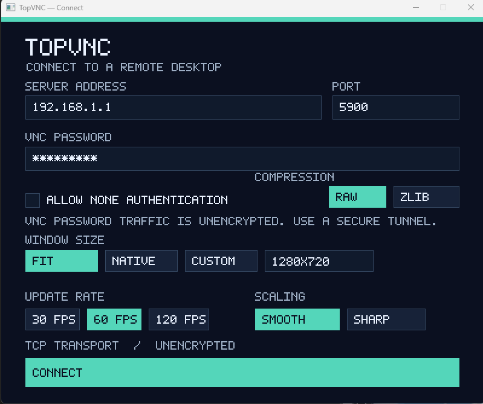

# TopVNC

A VNC viewer written in Rust, built toward responsive remote gaming with low input latency and smooth frame presentation.



*TopVNC running on Windows, with connection and display settings in one window.*

**Early development:** the native client has been compiled and tested on Windows and connected to a live macOS VNC server. Full remote control and macOS unlocking remain under live validation. macOS and Linux client builds are untested; a browser client is planned. Performance goals have not yet been established by end-to-end benchmarks.

[Quick start](#quick-start) · [Controls](#controls-and-display-settings) · [Security](#security-and-saved-settings) · [Development](#development) · [Roadmap](#roadmap)

## Features

- **Native connection UI** with a masked password field, input validation, and connection errors shown in the window.
- **Raw and Zlib encodings**, 32-bit true color, and incremental framebuffer updates.
- **Keyboard and mouse input** for interacting with the remote desktop.
- **Adjustable display** with fit-to-window or native pixels, smooth or sharp scaling, and 30, 60, or 120 FPS presentation limits.
- **In-session settings** accessible through **F8**, including disconnect and a resizable on-screen settings button.
- **Saved connection details** with platform-specific password storage.

The protocol implementation handles RFB 3.3, 3.7, and 3.8. Apple's `RFB 003.889` banner is handled through a standard RFB 3.8 fallback; Apple-specific authentication is not implemented.

## Quick start

You need a stable Rust toolchain with Cargo and native build tools for your platform. Windows is the currently tested client platform. To connect, you also need a reachable VNC server configured for standard VNC password authentication.

```sh
git clone https://github.com/yutigi/TopVNC.git
cd TopVNC
cargo run --release
```

1. Enter the server address and port (usually `5900`). Use brackets around IPv6 addresses, such as `[::1]`.
2. Enter the server's VNC password.
3. Choose Raw or Zlib, the initial window size, presentation rate, and scaling mode.
4. Click **Connect**. Press **F8** during the session to adjust display settings or disconnect.

> **Transport security:** TopVNC currently uses unencrypted TCP. VNC password authentication does not encrypt the framebuffer or input traffic. Use an isolated network or a separately secured tunnel for sensitive sessions. See [Security and saved settings](#security-and-saved-settings).

### Command-line options

Arguments prefill the connection form; they do not bypass it.

```sh
cargo run --release -- 127.0.0.1:5900
cargo run --release -- 127.0.0.1:5900 --window 1280x720
```

| Argument | Effect |
| --- | --- |
| `HOST:PORT` | Prefill the server address and port. |
| `--fit` | Fit the remote image to the viewer window. |
| `--native-size` | Show native pixels; center and crop if the image is larger than the window. |
| `--window WIDTHxHEIGHT` | Set a custom initial window size, such as `1280x720`. |
| `--allow-insecure` | Explicitly allow a server offering unauthenticated `None` security. |
| `--input-debug` | Log outgoing key and pointer events for troubleshooting. |

Do not use `--input-debug` while typing passwords: it logs key events.

## Controls and display settings

| Control or setting | Behavior |
| --- | --- |
| Keyboard and mouse | Send basic input to the remote desktop. |
| **F8** or **F8 SETTINGS** | Open the in-session settings panel. |
| Window edges | Drag to resize the viewer. |
| Fit | Scale the remote image to the window while preserving its aspect ratio. |
| Native | Display native pixels, centered and cropped when necessary. |
| Smooth / Sharp | Choose the scaling appearance. |
| 30 / 60 / 120 FPS | Cap local presentation rate. This does not guarantee the server's frame rate or set the network polling rate. |
| F8 button size | Adjust the on-screen settings button from 0.5× to 2.0×. |
| Disconnect | Return to the connection form. |

The initial viewer fits within the primary display by default when the remote screen is larger. Only affected regions are rescaled after framebuffer updates. The next incremental update is requested as soon as the previous update is decoded, independently of the presentation FPS limit.

## Security and saved settings

Standard VNC password authentication (security type 2) is implemented. Unauthenticated `None` security (type 1) requires an explicit checkbox or `--allow-insecure`; TopVNC does not silently downgrade to it. Both modes leave framebuffer and input traffic unencrypted. Username authentication and encrypted transport are not implemented.

The last successfully connected address and port are restored on the next launch. Authentication and transport security choices are never restored automatically.

| Client platform | Password storage implementation | Validation status |
| --- | --- | --- |
| Windows | Protected with the current user's DPAPI key. | Client compiled and tested. |
| Linux | Stored through Secret Service using `secret-tool`, when available. | Client untested. |
| macOS | Password is not saved; only the address and port are retained. | Client untested. |

## Troubleshooting

### Connecting to a Mac

The VNC password opens the screen-sharing connection. The macOS lock screen asks for that Mac user's login password, which may be different. Apple-specific authentication is not available, and the unlock transition still needs live verification.

### Frozen image or connection failure

If framebuffer data stops arriving, TopVNC requests a full refresh after five seconds, preserving partially received messages. If another five-second read wait expires during that update, it returns to the connection form with an error. This recovery is covered by simulated TCP server tests on Windows.

Address lookup/TCP connection and the RFB handshake each have a ten-second deadline. Connection and session failures are shown in the connection form.

### Input appears to be ignored

Launch with `--input-debug` to inspect outgoing key and pointer events. Avoid entering passwords or other sensitive text while logging, and remove sensitive details before sharing logs.

## Development

```sh
cargo fmt --all
cargo test --workspace
cargo clippy --workspace --all-targets
cargo run
```

### Code layout

| Path | Purpose |
| --- | --- |
| [`src/lib.rs`](src/lib.rs) | Reusable RFB protocol handling, authentication, decoding, framebuffer state, and session logic. |
| [`src/main.rs`](src/main.rs) | Native application, session worker, input handling, and software presentation. |
| [`src/ui.rs`](src/ui.rs) | Connection form and in-session settings UI. |
| [`src/settings.rs`](src/settings.rs) | Saved connection details and platform-specific password storage. |
| [`specs/`](specs/) | Feature scope and acceptance criteria. |

The native frontend uses TCP and a software window. Protocol and framebuffer code are kept separate from the UI so future frontends can reuse them. A browser frontend will need a browser-compatible transport and gateway because web pages cannot open raw VNC TCP sockets.

The project uses [GitHub Spec Kit](https://github.com/github/spec-kit) with Codex integration. Workflows live in `.agents/skills/`; templates and PowerShell scripts live in `.specify/`.

For contributions, read [AGENTS.md](AGENTS.md), record scope and acceptance criteria before large features, and run the checks above. Include the client OS, server software, encoding, and reproduction steps in bug reports. Measure latency, frame pacing, CPU, and memory use before claiming performance improvements.

## Roadmap

- Validate macOS unlock transitions and full remote control against live servers.
- Validate native clients on macOS and Linux.
- Add clipboard integration, remote desktop resizing, and relative pointer input.
- Expand authentication and transport security options, plus additional encodings.
- Add GPU presentation and profile end-to-end input-to-display latency.
- Build a browser client and gateway sharing the native session behavior where web APIs allow it.
